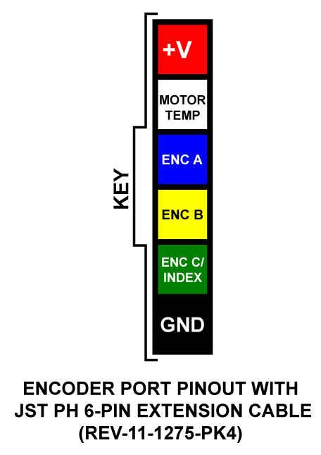

# Encoder Port


**We're Updating our Documentation!** For the most up-to-date information about the SPARK MAX and other ION Motor Controllers please check out the following new documentation pages:&#x20;

* [REV ION Brushless ](https://docs.revrobotics.com/brushless)
  * [SPARK MAX Resources](https://docs.revrobotics.com/brushless/links#spark-max-links)
  * [REVLib for SPARK MAX](https://docs.revrobotics.com/brushless/spark-max/revlib)
* [REV Hardware Client Documentation](https://docs.revrobotics.com/rev-hardware-client/)


Located on the motor output side of the SPARK MAX is a 6-pin Encoder Port. This port is designed to accept the built-in hall-encoder from the [NEO Brushless Motor](http://www.revrobotics.com/rev-21-1650/), but it can also connect to other external encoders when running in Brushed Mode. The connector details can be found below.&#x20;


The SPARK MAX can be configured to run in [Alternate Encoder Mode](../operating-modes/using-encoders/alternate-encoder-mode.md), which reconfigures the Data Port on the top of the controller to accept an alternative quadrature encoder in addition to the Encoder Port.


#### Encoder Port Connector Information

| **Connector Pin** | **Pin Type** |  **Pin Function** |
| :---------------: | :----------: | :---------------: |
|         1         |     Power    |       Ground      |
|         2         |    Digital   | Encoder C / Index |
|         3         |    Digital   |     Encoder B     |
|         4         |    Digital   |     Encoder A     |
|         5         |    Analog    | Motor Temperature |
|         6         |     Power    |        +5V        |

<figure><figcaption></figcaption></figure>

#### Mating Connector Information

| **Description**           | **Manufacturer** | **Part Number** | **Vendor** | **Vendor P/N**                                                                                                                                              |
| ------------------------- | ---------------- | --------------- | ---------- | ----------------------------------------------------------------------------------------------------------------------------------------------------------- |
| JST-PH 6-pin Housing      | JST              | PHR-6           | DigiKey    | [455-1162-ND](https://www.digikey.com/products/en?keywords=455-1162-ND)                                                                                     |
| JST-PH Contact            | JST              | SPH-002T-P0.5L  | DigiKey    | [455-2148-1-ND](https://www.digikey.com/products/en?keywords=455-2148-1-ND)                                                                                 |
| Recommended Crimping Tool | IWISS            | SN-2549         | Amazon     | [SN-2549](https://www.amazon.com/IWISS-Crimping-AWG28-18-Ratcheting-Connector/dp/B01N4L8QMW/ref=sr\_1\_2?ie=UTF8\&qid=1546882885\&sr=8-2\&keywords=sn-2549) |
