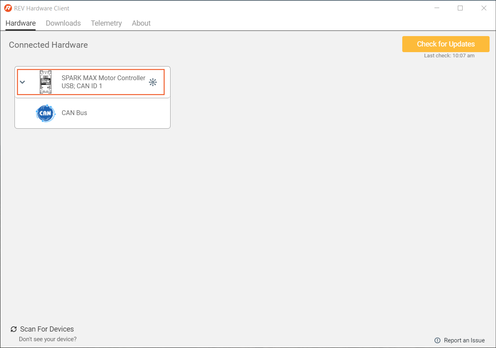
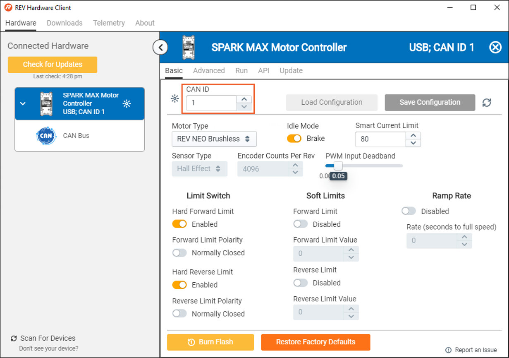
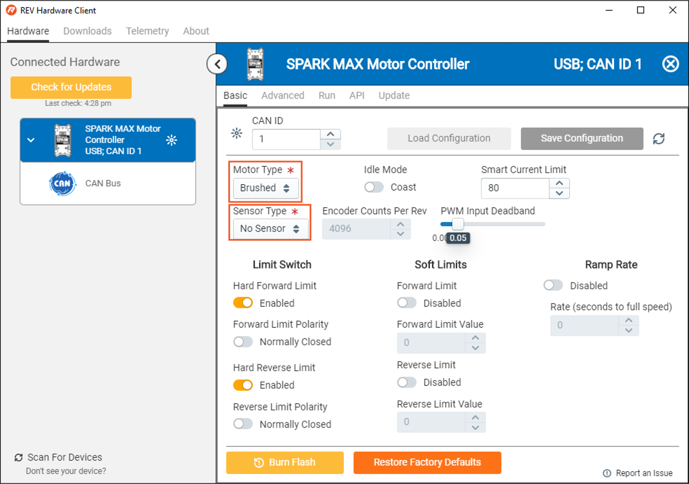
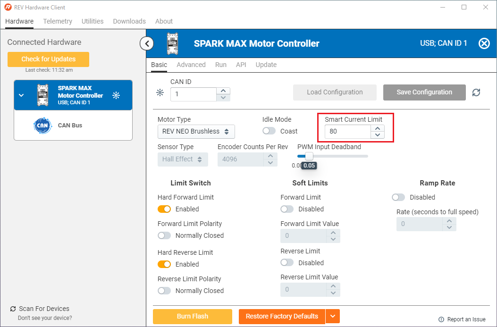
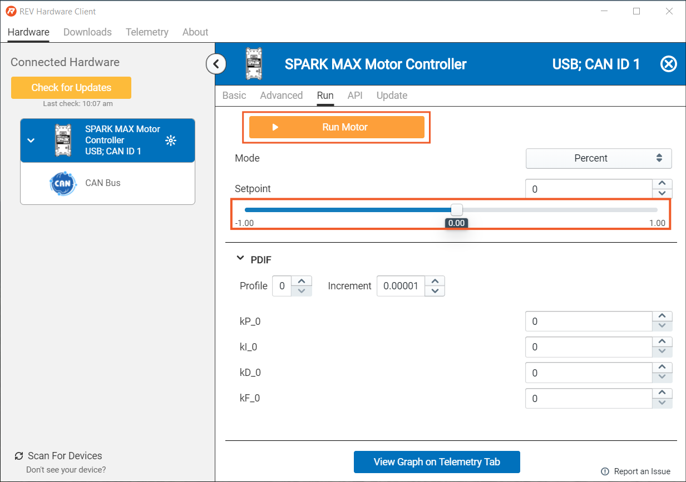

# Make it Spin!

## Power On

Now that the device is wired, and the connections carefully checked, power on the robot. You should see the SPARK MAX slowly blinking its for a new device the color will be Magenta. If the LED is dark, or you see a different blink pattern, refer to the [Status LED](../status-led.md) guide for troubleshooting.&#x20;


If you are using a brushed motor, you may see a sensor error. This is expected until you configure the device to accept a brushed motor in the following steps.


## Connect to the SPARK MAX

Plug in the USB cable and start the REV Hardware Client. Select the SPARK MAX from the Connected Hardware


If you can not see the SPARK MAX, make sure that the SPARK MAX is not being used by another application
. Then unplug the SPARK MAX from the computer and plug it back in.


## Basic Setup and Configuration

Before any parameters can be changed, you **must** first assign a unique CAN ID to the device. This can be any number between 1 and 63. After setting a unique CAN ID, the user interface will refresh and allow you to change other parameters.


Eventually you may set up a CAN network on your test bench or robot. Be sure each device on the network has a unique CAN ID. It is helpful to label each device with its ID number to aid in troubleshooting.


### Set the Motor Type

If you are using a NEO or NEO 550, verify that the motor type is set to **REV NEO Brushless**, Sensor Type is **Hall Effect**, and the LED is blinking Magenta or Cyan.


If you see a _Sensor Fault_ blink code, make sure the encoder cable is plugged in completely.


If you are running brushed motor, set the motor type to **Brushed**, sensor type as **No Sensor**, and verify that the LED is blinking Yellow or Blue.

### Limiting Current

There are two ways to protect your robot’s motors from electrical damage in high-current situations: Circuit Breakers and the SPARK MAX’s Smart Current Limit Setting. To protect your motors from currents that are too high, it is a best practice to limit your current both with the SPARK MAX’s Smart Current Limit **and** an appropriately rated circuit breaker.

Circuit breakers, while an extremely important part of a robot's wiring and safety, are only designed to trip at a specific temperature, after a set amount of time, to protect the electrical system from fire or other electrical hazards. Due to this, we recommend setting a Smart Current Limit to protect your motors from damage due to high currents.

The SPARK MAX Motor Controller includes a Smart Current Limit feature that can adjust the applied output to the motor to maintain a constant phase current.&#x20;

Out of the box, the SPARK MAX's Smart Current Limit default setting is 80A for any motor that you use. We recommend utilizing our locked-rotor testing data or the table below to decide what to set your Smart Current Limit to for your robot: Locked-Rotor Testing for the [NEO (REV-21-1650) ](https://www.revrobotics.com/neo-brushless-motor-locked-rotor-testing/)and [NEO 550 (REV-21-1651)](https://www.revrobotics.com/neo-550-brushless-motor-locked-rotor-testing/).


Remember that some settings, like Smart Current Limit, must be burned to flash via code or the Hardware Client in order to be retained through a power cycle of the SPARK MAX.


#### Suggested Current Limits

Your ideal current limit may vary based on your specific application, but these values can be used as a starting point to reduce the chance of an overload on your motor as you begin tuning your specific mechanism's Smart Current Limit.

| Motor Type                                                        | Current Limit Range |
| ----------------------------------------------------------------- | ------------------- |
| NEO ([REV-21-1650](https://www.revrobotics.com/rev-21-1650/))     | 40A - 60A           |
| NEO 550 ([REV-21-1651](https://www.revrobotics.com/rev-21-1651/)) | 20A - 40A           |


Warning: Setting current limits outside of the suggested ranges listed above may cause unintended overload and severe damage to components that are not covered by warranty.


## Save the Settings

The settings must be saved for the SPARK MAX to remember its new configuration through a power cycle. To do this, press the _Burn Flash_ button at the bottom of the page. It will take a few seconds to save, indicated by the loading symbol on the button.

Any settings saved this way will be remembered when the device is powered back on. You can always restore the factory defaults if you need to reset the device.

## Spin the Motor


Before running any motor, make sure all components are in a safe state, that the motor is secured, and that anyone nearby is aware. FRC motors are very powerful and can quickly cause damage to people and property.&#x20;



Keep the CAN cable disconnected throughout the test. For safety reasons, the REV Hardware Client will not run the motor if the roboRIO is connected. If the roboRIO was connected, power cycle the SPARK MAX.


To spin the motor, go to the Run tab, keep all of the default settings and press _Run_ _Motor._ The _setpoint_ is 0 by default, meaning that the motor is being commanded to **idle** (0% power). When you press _Run_ you should see the LED go from slow blinking to solid, indicating that the motor is idling.

**Slowly** ramp the setpoint slider up. The motor should start to spin and you should see a green blink pattern proportional to the speed you have set to the motor. Slowly ramp the slider down. The motor should spin in reverse, and you should see a red blink pattern proportional to the speed you have set to the motor.

If you are unable to spin the motor, visit our [troubleshooting guide](../spark-max-client/troubleshooting.md).
