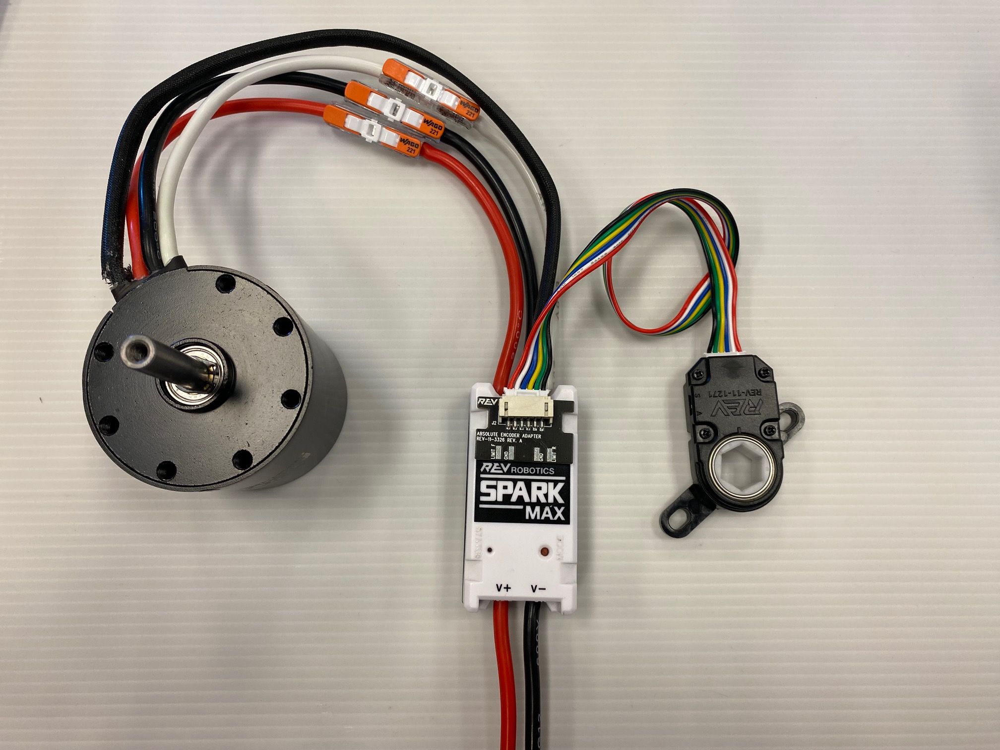
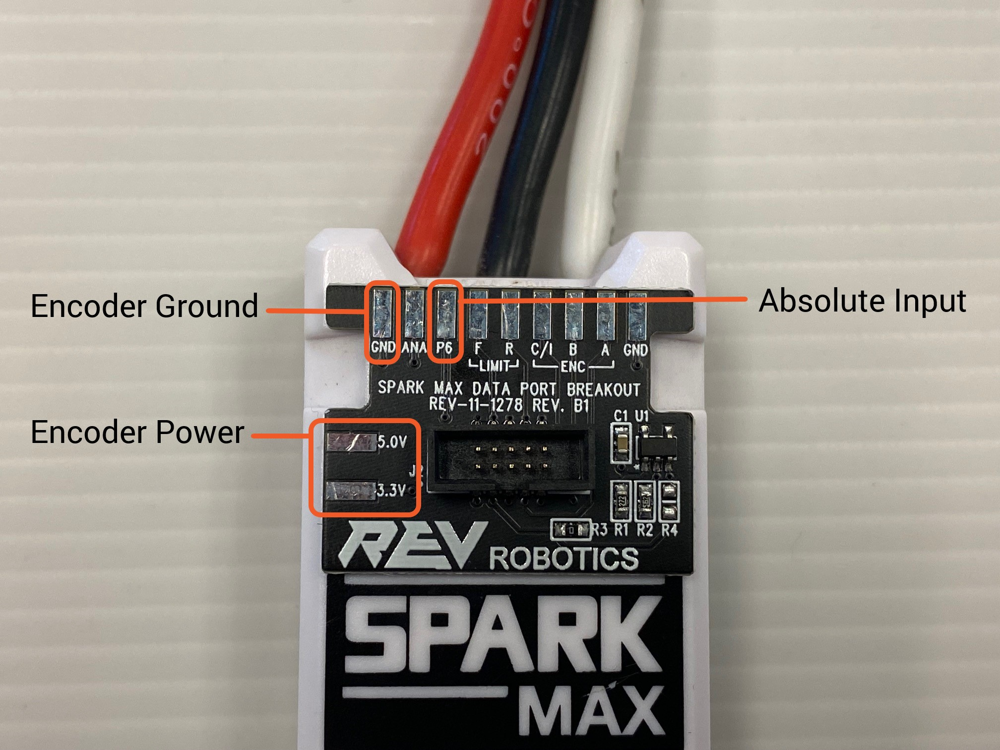
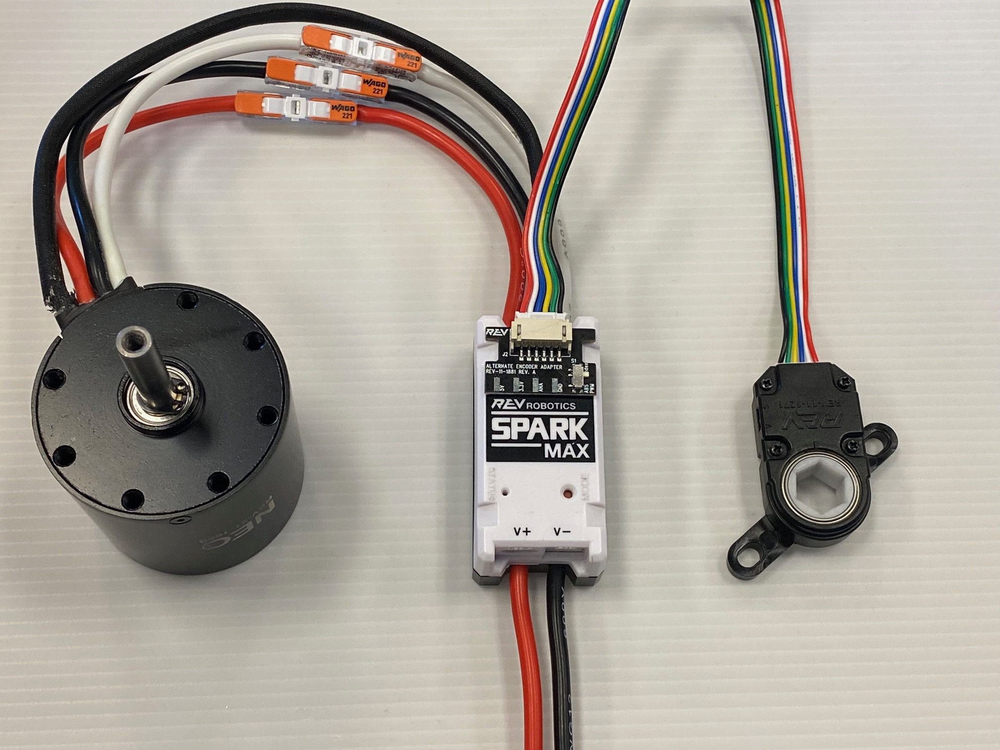
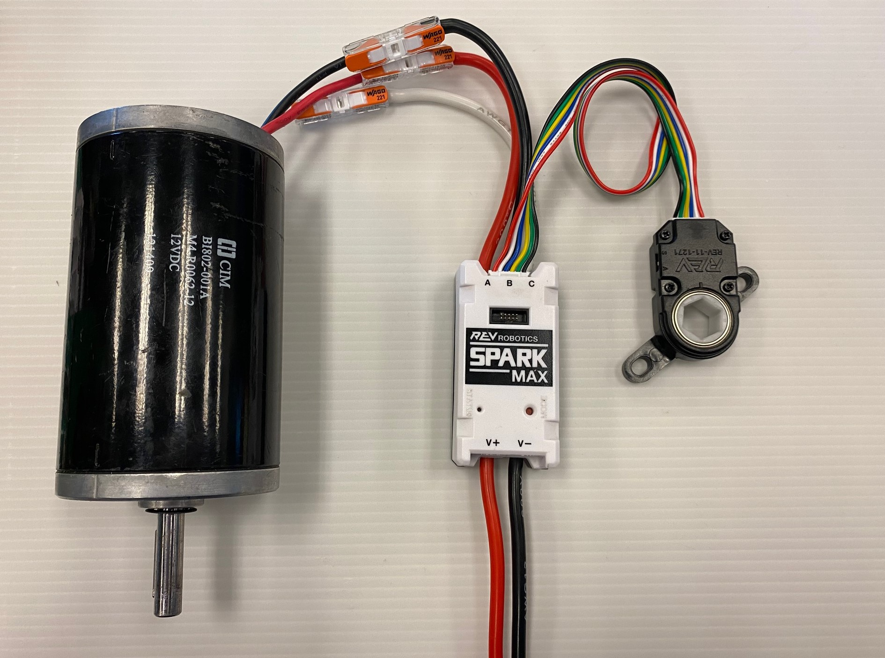
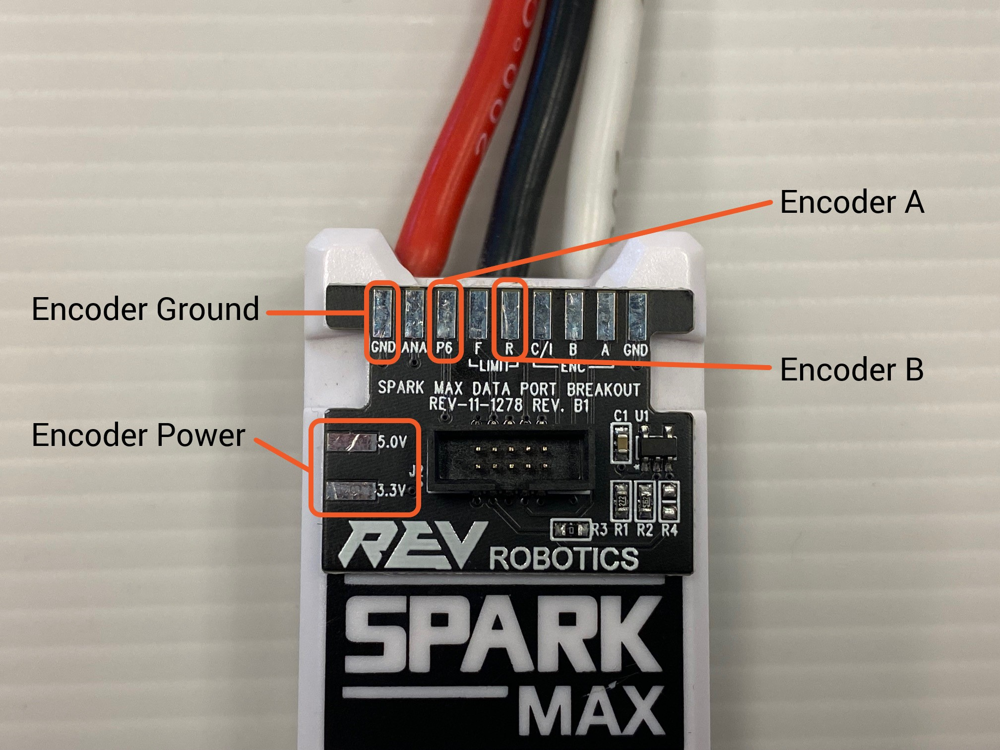

# Using Encoders

The SPARK MAX can accept data from encoders through both the Encoder Port and the Data Port on the top of the motor controller. Encoders have a different method of connecting to the SPARK MAX that depends on what motor you are using and what type of encoder it is. When preparing your encoders, be sure to set up your SPARK MAX correctly for the type of devices you are using.&#x20;

## Incremental vs Absolute Encoders

Incremental encoders measure a change in position as a mechanism rotates while absolute encoders will report an exact position at any time, including at startup. A common analogy to help with knowing the difference is that incremental encoders are like a stopwatch that measures a change in time and absolute encoders are like a clock where you can know exactly what time it is.&#x20;

With [SPARK MAX Firmware](../../software-resources/spark-max-firmware-change-log.md) Versions 1.6.0 and newer, absolute encoders are compatible with the SPARK MAX Data Port.

## How to Connect an Encoder

To connect an encoder to your SPARK MAX, start by identifying what type of encoder you are using. Below is a flowchart to help generally identify the method you should use.

<figure><figcaption></figcaption></figure>


Running a brushless motor, like the NEO and NEO 550, without the integrated encoder plugged into the SPARK MAX's Encoder Port can damage your motor.&#x20;


### Absolute Encoders

Absolute encoders will work with the default pinout of the SPARK MAX Data Port if the latest firmware has been installed. When using an absolute or duty cycle encoder it is recommended to use one of the following methods to connect your encoder to the SPARK MAX.

* [Through Bore Encoder (REV-11-1271)](https://www.revrobotics.com/rev-11-1271/): Connect with [Absolute Encoder Adapter (REV-11-3326)](https://www.revrobotics.com/rev-11-3326/)
* Other Absolute Encoder: Connect with [SPARK MAX Data Port Breakout Board (REV-11-1278)](https://www.revrobotics.com/rev-11-1278/)
  * Use the Data Port Pinout to match the signals from your encoder


Absolute Encoders are only supported through the SPARK MAX Data Port at this time


#### Absolute Encoder Wiring Examples



Easily connect a Through Bore Encoder to your SPARK MAX with an Absolute Encoder Adapter and a 6-Pin JST PH Cable.

<figure><figcaption></figcaption></figure>



For encoders that need a custom wiring harness, you can use the following solder pads on a SPARK MAX Data Port Breakout Board with any generic absolute encoder.&#x20;

<figure><figcaption></figcaption></figure>



## Incremental Encoders

If you are using an Incremental Encoder with a **brushed motor** you can plug your encoder into the SPARK MAX's front Encoder Port directly. If you are driving a NEO or NEO 550 **brushless motor** with your SPARK MAX, you will need to configure Alternate Encoder Mode to accommodate the additional encoder input from the Data Port. When using an incremental or quadrature encoder it is recommended to use one of the following methods to connect your encoder to the SPARK MAX.

* [NEO](https://www.revrobotics.com/rev-21-1650/) or [NEO 550](https://www.revrobotics.com/rev-21-1651/) Internal Encoder: **MUST** be connected to the SPARK MAX Encoder Port
* [Through Bore Encoder (REV-11-1271)](https://www.revrobotics.com/rev-11-1271/)&#x20;
  * With brushless motor: Connect with [Alternate Encoder Adapter (REV-11-1881)](https://www.revrobotics.com/rev-11-1881/). **You will need to configure Alternate Encoder Mode.**
  * With brushed motor: Connect to the Encoder Port
* Other Incremental Encoder&#x20;
  * With a brushless motor: Connect the encoder with [SPARK MAX Data Port Breakout Board (REV-11-1278)](https://www.revrobotics.com/rev-11-1278/). Use the Alternate Encoder Mode Data Port Pinout to match the signals from your encoder. **You will need to configure Alternate Encoder Mode.**
  * With brushed motor: Connect to the Encoder Port with a [6-Pin JST Breakout Board (REV-11-1276)](https://www.revrobotics.com/rev-11-1276/) using the Encoder Port pinout
  * With a brushed motor: Connect the encoder with [SPARK MAX Data Port Breakout Board (REV-11-1278)](https://www.revrobotics.com/rev-11-1278/) or a similar custom cable. Use the Data Port Pinout to match the signals from your encoder.&#x20;

#### Incremental Encoder Wiring Examples



Easily connect a Through Bore Encoder to your SPARK MAX with an Alternate Encoder Adapter and a 6-Pin JST PH Cable. When using the Alternate Encoder Adapter make sure the switch is set to "index".

<figure><figcaption></figcaption></figure>



A Through Bore Encoder, or any incremental encoder with the same pinout, can be plugged in directly to the SPARK MAX's Encoder Port.&#x20;

<figure><figcaption></figcaption></figure>



For encoders that need a custom wiring harness, you can use the following solder pads on a SPARK MAX Data Port Breakout Board with any generic incremental encoder.&#x20;

<figure><figcaption></figcaption></figure>



## Receiving both Incremental and Absolute Encoder Feedback

Receiving both Incremental and Absolute encoder feedback from a single encoder through the SPARK MAX directly is not currently supported. To do this you will need to wire the encoder directly to your roboRIO or robot controller.&#x20;

## Using Limit Switches with an Encoder

Currently, Limit Switch inputs are only supported when using an absolute encoder or an incremental encoder run through the SPARK MAX's Encoder port. **Please note, the limit switch inputs cannot be used at the same time as an Alternate Encoder Mode.** The limit switch pins are repurposed for the alternate encoder and are thus disabled.&#x20;
