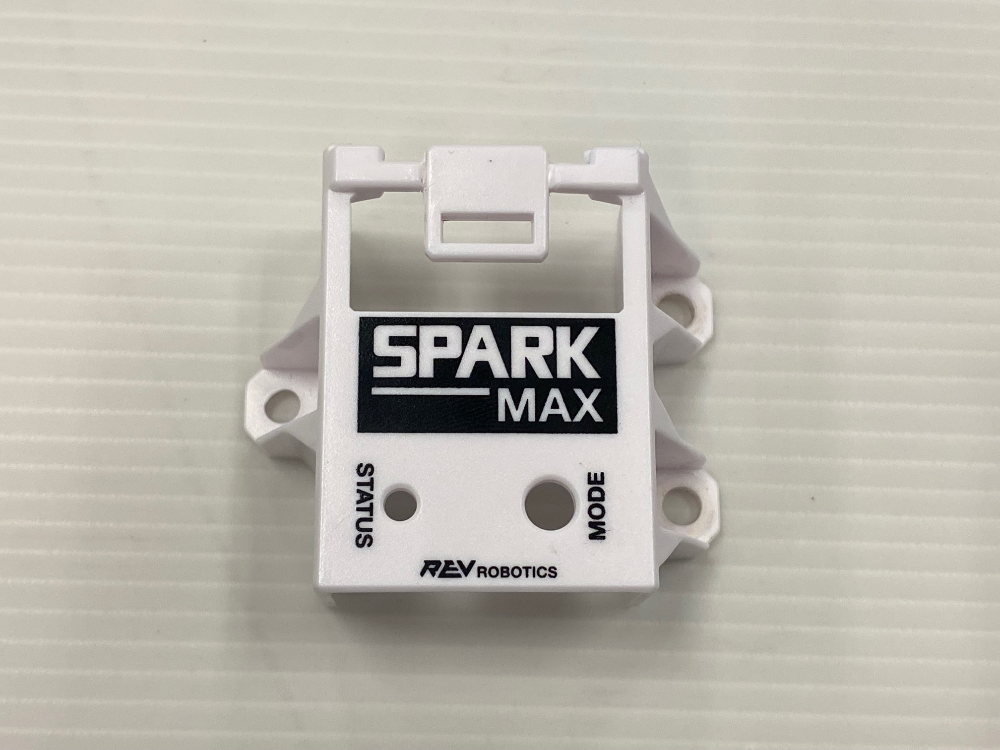
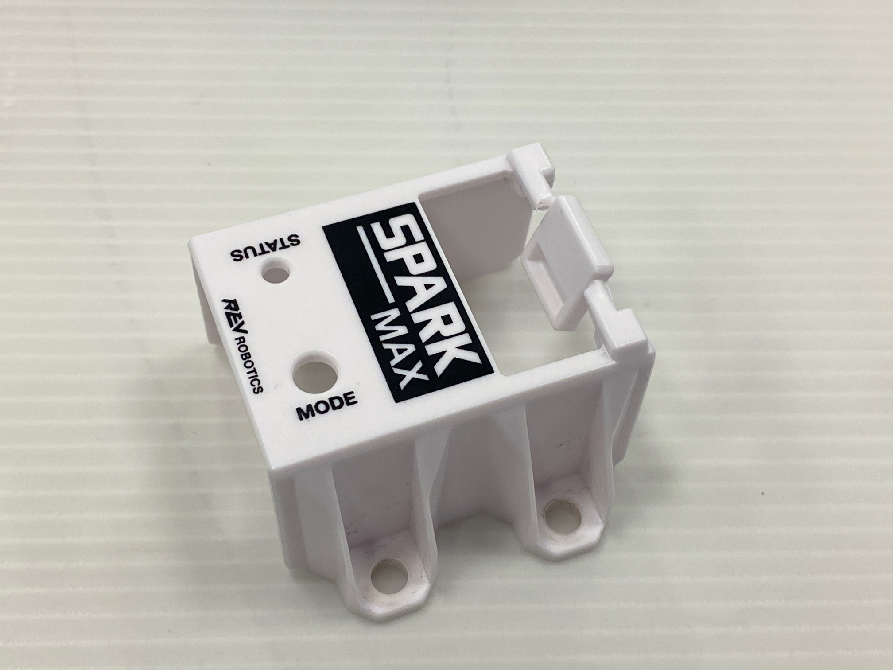
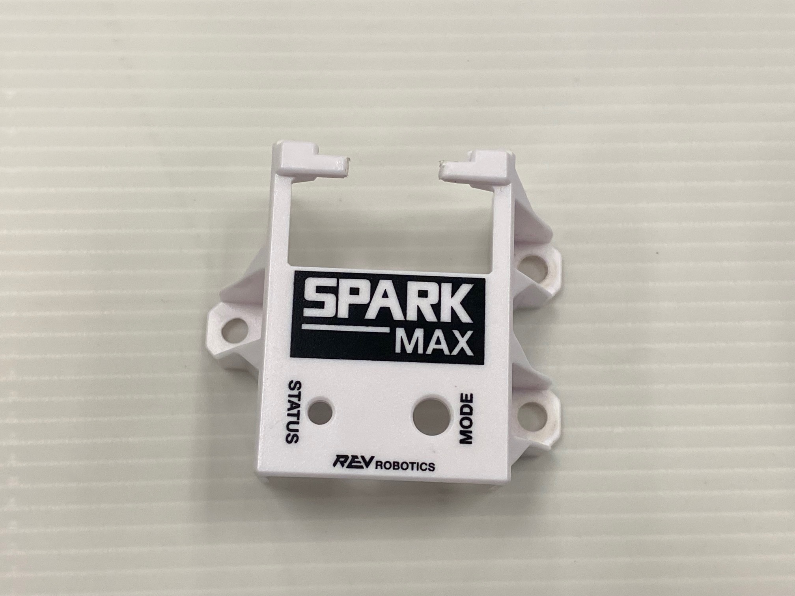
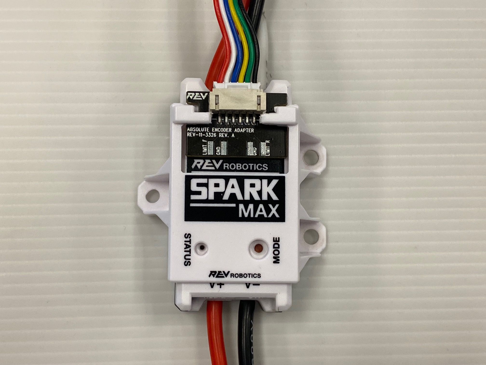
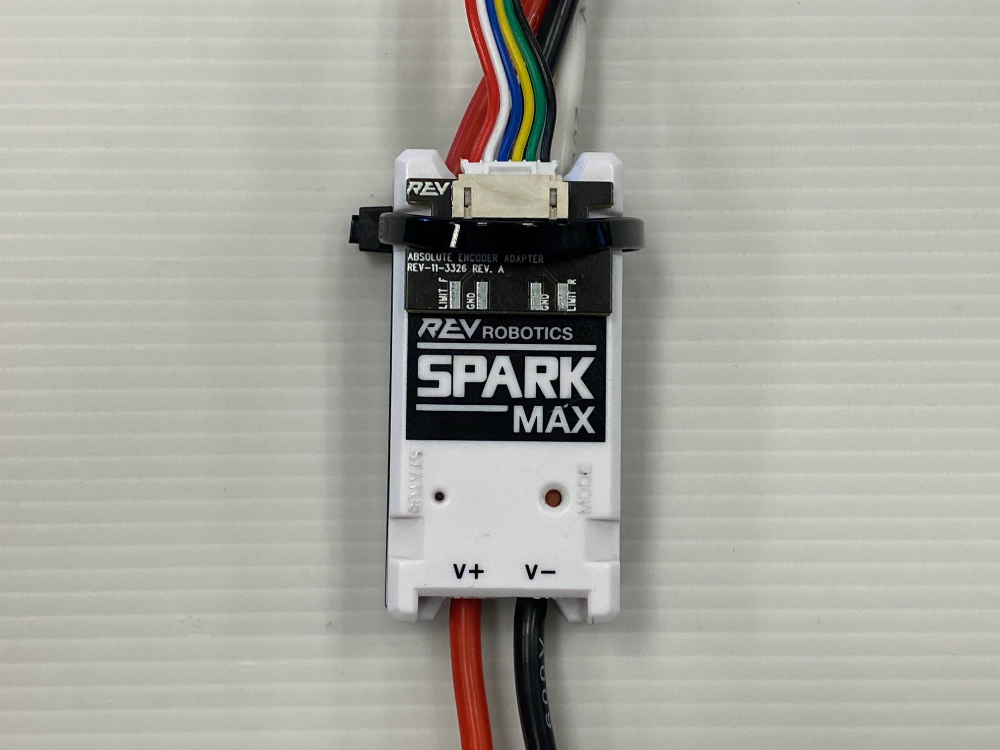

# Securing the Encoder Adapters

The Encoder Adapters and SPARK MAX Data Port Breakout Boards can be secured to a SPARK MAX in two ways.

## SPARK MAX Mounting Bracket ([REV-45-2468](https://www.revrobotics.com/rev-45-2468-pk2/))

| Description                                                                                                                                                         | Image                                             |
| ------------------------------------------------------------------------------------------------------------------------------------------------------------------- | ------------------------------------------------- |
| 1) To use a SPARK MAX Mounting Bracket to secure your Encoder Adapter or Breakout Board you will need to remove the middle tab of plastic                           |  |
| 2) Cut this piece of plastic with a pair of snips, or remove it by twisting the plastic until it breaks                                                             |  |
| 3) Once the middle piece of plastic has been removed, remove any sharp edges with a file or some sandpaper                                                          |  |
| 4) The SPARK MAX Mounting Bracket will fit over the board as shown in this image. Attach the mounting bracket to your surface as you normally would after this step |  |

## Zip-tie Notches

A zip-tie can be secured around the SPARK MAX's zip-tie notches and over the board to securely attach it to the motor controller as well.&#x20;

<figure><figcaption></figcaption></figure>
