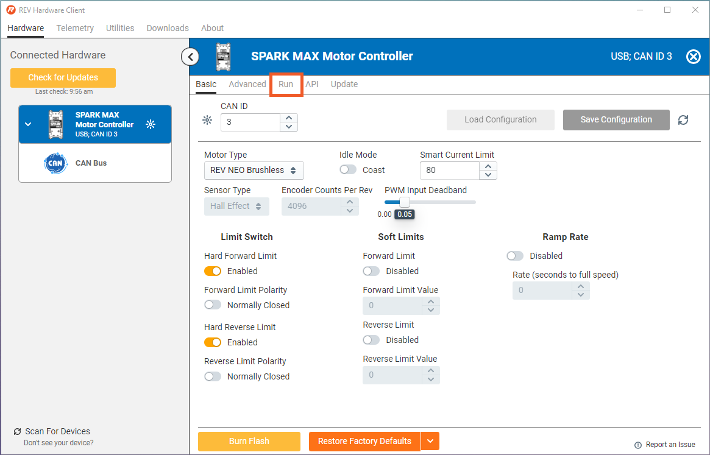
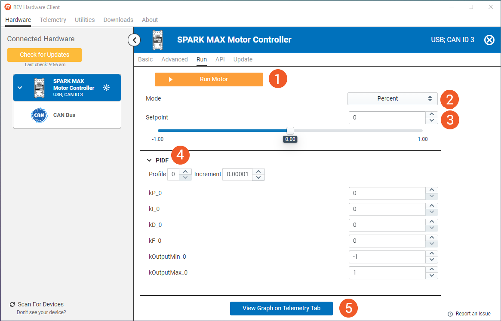

# Running a Motor


**We're Updating our Documentation!** For the most up-to-date information about the SPARK MAX and other ION Motor Controllers please check out the following new documentation pages:&#x20;

* [REV ION Brushless ](https://docs.revrobotics.com/brushless)
  * [SPARK MAX Resources](https://docs.revrobotics.com/brushless/links#spark-max-links)
  * [REVLib for SPARK MAX](https://docs.revrobotics.com/brushless/spark-max/revlib)
* [REV Hardware Client Documentation](https://docs.revrobotics.com/rev-hardware-client/)


## Set Up

### Materials Needed

* 12V Power source
* SPARK MAX
* Motor connected to the SPARK MAX
* Windows Computer with the REV Hardware Client installed
* Data Capable USB C cable

### Connecting to REV Hardware Client

First, connect your SPARK MAX to a computer with the REV Hardware Client installed via a data capable USB C cable. Then selecting it from the list of connected devices.&#x20;

.png>)

Verify that the settings are correct for the motor you have attached to your SPARK MAX. Once you have verified the settings and hit "Burn Flash" to save any changes, click on the run tab.

## Run Tab

Within the Run Tab you can run one motor with a SPARK MAX. You can control it in many different ways, and change the PIDF algorithm.&#x20;


Need to run more than one SPARK MAX? If on the same CAN Bus you can run multiple SPARK MAX motor controllers using the [Run Multiple](telemetry-tab.md#run-multiple) function under the [Telemetry Tab!](telemetry-tab.md)


1. **Run Motor:** Click this button to run the motor with the selected settings
2. **Mode:** Choose the run mode for running your motor. Percent mode is a great starting point for turning a motor on to test a prototype mechanism.&#x20;
3. **Setpoint:** Set the value for running the motor here
4. **PIDF:** Adjust your PIDF algorithm here. You can learn more about PIDF in our section on [Closed Loop Control](../operating-modes/closed-loop-control.md)
5. **View Graph:** Shortcut to the [Telemetry Tab](telemetry-tab.md) to view data about your SPARK MAX

## Running a Motor

Once your settings have been chosen, click the orange Run Motor button.

When you are done running your motor, press the Stop Motor button.

