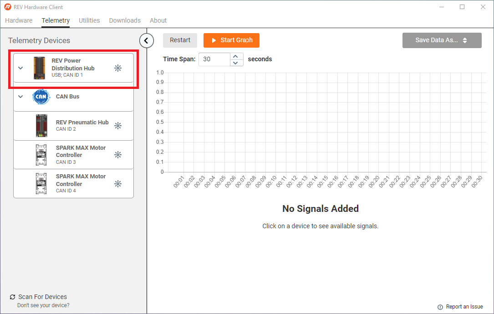
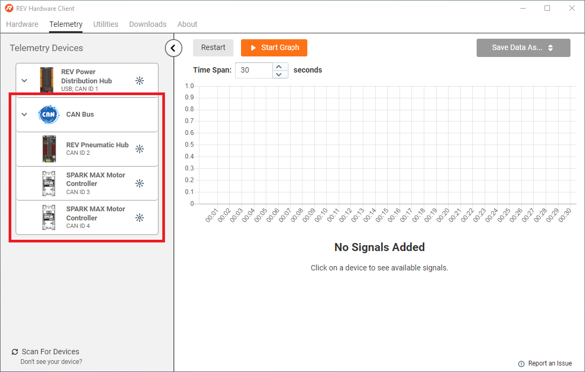
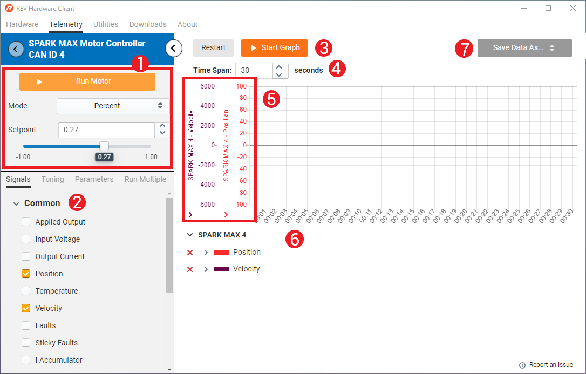
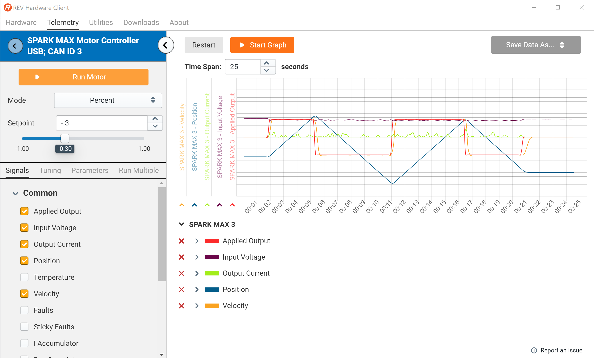

# Telemetry Tab


**We're Updating our Documentation!** For the most up-to-date information about the SPARK MAX and other ION Motor Controllers please check out the following new documentation pages:&#x20;

* [REV ION Brushless ](https://docs.revrobotics.com/brushless)
  * [SPARK MAX Resources](https://docs.revrobotics.com/brushless/links#spark-max-links)
  * [REVLib for SPARK MAX](https://docs.revrobotics.com/brushless/spark-max/revlib)
* [REV Hardware Client Documentation](https://docs.revrobotics.com/rev-hardware-client/)


### Connected Devices

Devices available in the REV Hardware Client are shown on the left side of the window. The device that the USB C Cable is connected to will be listed first, followed by any devices connected over CAN.&#x20;

 

## Telemetry Settings

### Signals and Graph

1. **Run Motor:** Choose setpoints to run a motor connected to a SPARK MAX using various modes, including position, velocity, and duty cycle.
2. **Signals:** Select the different signals from the SPARK MAX you want to monitor here
3. **Start & Restart Graph:** Start initiates recording of telemetry. Restart will erase the data and start again
4. **Time Span:** Change the time span shown on the x-axis of the graph
5. **Scales:** Different Signals will have different scales for the y-axis. You can change which are shown by clicking the arrows here
6. **Signal Key and Scale Adjustment:** Signals you choose to monitor will be shown here. Click **X** to delete a signal from the graph and **>** to adjust the scale of the signal's graph y-axis
7. **Save Data:** Save your data as a .CSV or image using this menu

### Tuning

Update PIDF parameters on the fly to tune control loops on the SPARK MAX.

### Parameters

Select the arrow to show all configurable parameters within a specific group. For more information on each parameter type see [Configuration Parameters](../software-resources/configuration-parameters.md).

### Run Multiple

Run multiple SPARK MAX and motor pairs over CAN using various modes, including position, velocity, and duty cycle.


If you are only using multiple SPARK MAXs and a power source, you can terminate both ends of your CAN Bus with 120Ω resistors!


## Editing the Y-Axis Scale

1. **Y-Axis Labels:** Select the label you want to view by clicking the arrow at the bottom of the label. In this image the Power Distribution Hub Channel Currents are selected.
2. **Y-Axis Scale:** Use the drop down arrow next to the parameter you would like to change the scale for. Be sure to un-check the "use defaults" box to apply your changes.&#x20;

## Example

In this example the SPARK MAX and NEO Motor were run at 30% power, switching between forwards and backwards several times. The first switch in direction occurs near t=5s where you can see the Applied Output, Position, and Velocity change.&#x20;
