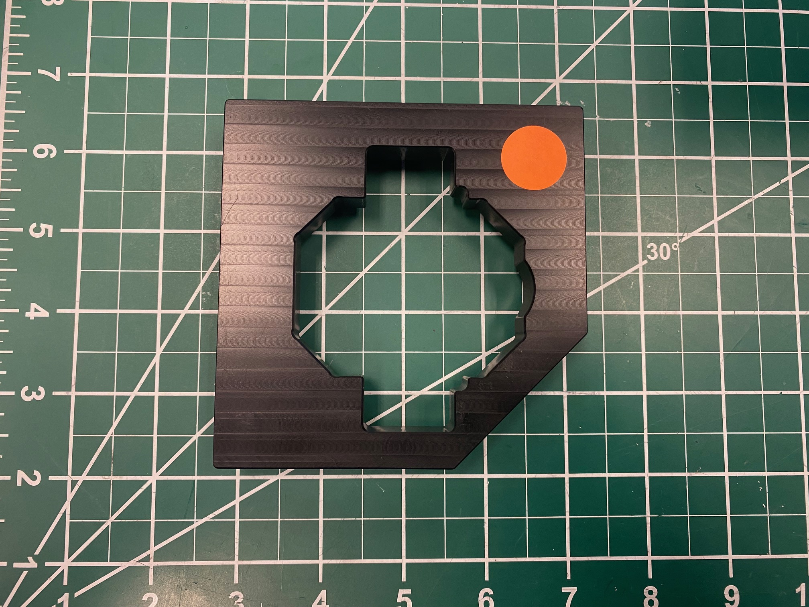
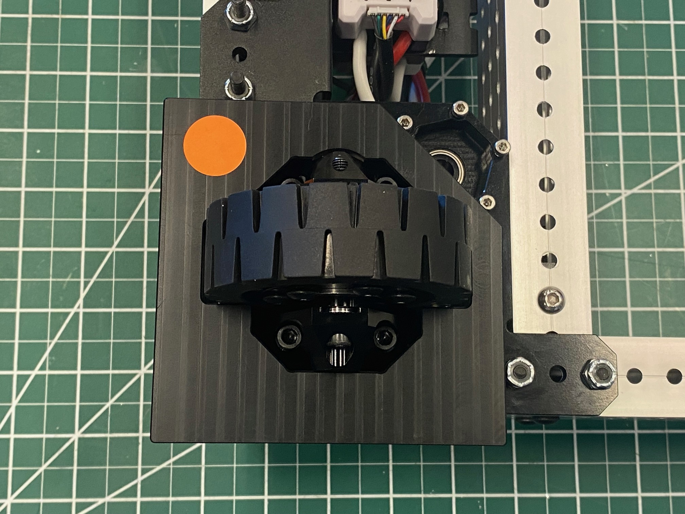

# Calibration for MAXSwerve

Before using the MAXSwerve Java or C++ Templates, be sure to calibrate your swerve modules using the [REV Hardware Client](../rev-hardware-client/getting-started-with-the-rev-hardware-client/).



## Calibration Steps

1. Verify you have completely assembled your [MAXSwerve Module](https://docs.revrobotics.com/ion-build-system/build-guides/3in-maxswerve-module) and have the Steering Motor’s (NEO 550) SPARK MAX connected to the MAXSwerve’s Through Bore Encoder with an Absolute Encoder Adapter.

<figure><figcaption></figcaption></figure>

2. Install and Open the Latest version of the [REV Hardware Client](../rev-hardware-client/getting-started-with-the-rev-hardware-client/) onto a Windows computer
3. Connect the Steering Motor’s (NEO 550) SPARK MAX directly to your computer via the included USB-C to USB-A cable
4. Select the Steering SPARK MAX and navigate to the **Update Tab** to verify your SPARK MAX has the latest SPARK MAX Firmware (the latest version may be different than what is shown in the image below)

<figure><figcaption></figcaption></figure>

5. Select The Steering SPARK MAX in the sidebar, and select the **AbsoluteEncoder** Tab


Steps 6-9 are also included in the REV Hardware Client **AbsoluteEncoder Tab** under the “MAXSwerve Module Calibration” drop-down shown below


<figure><figcaption></figcaption></figure>

6. Put the Calibration Tool on the MAXSwerve module.
   * The Calibration Tool needs to be placed on the MAXSwerve module with the lip facing the module.
   * The MAXSwerve Wheel will only fit in one orientation because of the placement of the wheel's bevel gear. The Calibration tool is not symmetrical, so you will need to align the bevel gear with the side of the cutout indicated with the orange dot in this image.&#x20;

<figure><figcaption></figcaption></figure>

 

<figure><figcaption></figcaption></figure>

7. Rotate the wheel along with the Calibration Tool until the tool's lip firmly drops into place around the MAXSwerve module's edges. Once this happens, the wheel and Calibration Tool will be unable to rotate freely until the tool's lip has been lifted above the edges of the module.
8. Ensure that the Direction parameter is set to  Inverted in the Duty Cycle Absolute Encoder Settings section above.
9. Click the Set Zero Offset button to calibrate the zero-position of the absolute encoder to this position.

<figure><figcaption></figcaption></figure>

## What's Next?

Start driving your MAXSwerve Modules by loading our code templates onto your robot!

### [MAXSwerve Java Template](https://github.com/REVrobotics/MAXSwerve-Java-Template)

### [MAXSwerve C++ Template](https://github.com/REVrobotics/MAXSwerve-Cpp-Template)
