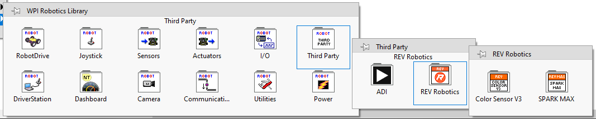

# REVLib Information

Below you will find information on how to download and install REVLib for LabVIEW, Java, and C++.

| **Language**            | Current REVLib Version |              Documentation             |
| ----------------------- |:----------------------:| :------------------------------------: |
| [LabVIEW](./#labview)   |        2023.1.3        |         Embedded (Press Ctrl-H)        |
| [Java](./#c++-and-java) |        2023.1.3        | [Java Docs](./#java-api-documentation) |
| [C++](./#c++-and-java)  |        2023.1.3        |  [C++ Docs](./#c++-api-documentation)  |

### Migrating from the SPARK MAX API and/or Color Sensor V3 API

Beginning with 2022, The SPARK MAX API and the Color Sensor V3 API have been merged into a unified library called REVLib. You need to make sure that you have uninstalled those old libraries before you install REVLib.

#### LabVIEW migration

1. Ensure that the old SPARK MAX API and/or Color Sensor V3 API packages are uninstalled.
2. [Install the REVLib package](./#labview).
3. Opening a project that used the old APIs should work fine. When it is loading, it may show that there are some missing VIs, but eventually LabVIEW should find the new VIs automatically.

#### C++/Java migration

1. Open your robot project in VSCode.
2. Click on the WPI icon in the corner to open the WPI Command Pallet.
3. Select **Manage Vendor Libraries**.
4. Select **Manage Current Libraries**.
5. Check the `REVRobotics` and/or `REVColorSensorV3` items (whichever ones are present)
6. Click the `OK` button to uninstall them.
7. Install REVLib for [C++ and Java](./#c++-and-java).

## Downloads and Installation Instructions

### LabVIEW

|                                                                                  REVLib LabVIEW - Version 2023.1.3                                                                                   |
|:----------------------------------------------------------------------------------------------------------------------------------------------------------------------------------------------------:|
|  |

1. Download the latest REVLib LabVIEW package from the download link above.
2. Make sure LabVIEW for FRC 2023 is installed and updated.
3. Open the REVLib LabVIEW Package. The NI Package Manager should automatically open.
4.  Click **Next**:

    <figure><figcaption></figcaption></figure>
5.  Once the installation is complete, you will be able to access the REVLib VIs at **LabVIEW Functions Pallet -> WPI Robotics Library -> Third Party -> REV Robotics**.

    <figure><figcaption></figcaption></figure>

### C++ and Java

|                                                                        REVLib C++/Java - Version 2023.1.3                                                                        |
| :------------------------------------------------------------------------------------------------------------------------------------------------------------------------------: |
|  |

#### Online Installation

You can use the online method to install REVLib C++/Java if your development machine is connected to the internet:

1. Open your robot project in VSCode.
2. Click on the WPI icon in the corner to open the WPI Command Pallet.
3. Select **Manage Vendor Libraries**.
4. Select **Install new library (online)**.
5.  Enter the following installation URL and press ENTER:

    [`https://software-metadata.revrobotics.com/REVLib-2023.json`](https://software-metadata.revrobotics.com/REVLib-2023.json)

#### Offline Installation

1. Download and unzip the latest REVLib into the _C:\Users\Public\wpilib\2023_ directory on Windows and _\~/wpilib/2023_ directory on Unix-like systems.
2. Follow the WPILib instructions for [Adding Offline Libraries](https://docs.wpilib.org/en/latest/docs/software/vscode-overview/3rd-party-libraries.html#adding-offline-libraries).

## Java API Documentation

For a list and description of all classes:

* [Online REVLib Java Documentation](https://codedocs.revrobotics.com/java/com/revrobotics/package-summary.html)

## C++ API Documentation

For a list and description of all classes:

* [Online REVLib C++ Documentation](https://codedocs.revrobotics.com/cpp/namespacerev.html)

## Changelog
### Version 2023.1.3
**This version of REVLib requires SPARK MAX Firmware v1.6.3. Please update your SPARK MAX through the REV Hardware Client.**

* Improves documentation for the setZeroOffset() and getZeroOffset() methods on Absolute Encoder objects
* Fixes issue where reading an absolute encoder’s zero offset could return an incorrect value in certain conditions

### Version 2023.1.2
**This version of REVLib requires SPARK MAX Firmware v1.6.2. Please update your SPARK MAX through the REV Hardware Client.**

* Adds support to configure the hall sensor's velocity measurement
  * C++/Java: Updates `SetMeasurementPeriod()` and `SetAverageDepth()` in the `SparkMaxRelativeEncoder` class to be used when the relative encoder is configured to be of type `kHallSensor`.
  * LabVIEW: Adds `SPARK MAX Configure Hall Sensor.vi` and `SPARK MAX Get Hall Sensor Config.vi` to set and get the hall sensor's measurement period and average depth.

### Version 2023.1.1
* Adds support for WPILib 2023
* Adds support for using a duty cycle absolute encoder as a feedback device for the SPARK MAX
  * C++/Java: Adds SparkMaxAbsoluteEncoder class
  * LabVIEW: Adds VIs for configuring and getting the values from a duty cycle absolute encoder
* Adds Position PID Wrapping to allow continuous input for the SPARK MAX PID controller
  * C++/Java: Adds PositionPIDWrapping methods to the SparkMaxPIDController class
  * LabVIEW: Adds VIs for setting and getting the Position PID Wrapping configuration
* Allows configuring the periodic frame rates for status frames 4-6

### Version 2022.1.2

#### Breaking Changes

* LabVIEW: The version of NI Package Manager bundled with the FRC LabVIEW offline installer will no longer work when installing the REVLib package. NIPM must be updated to the latest version or installed from the FRC LabVIEW online installer to be able to install this package of REVLib for LabVIEW

#### Enhancements

* LabVIEW: Adds `Spark MAX Set Inverted.vi` and `Spark MAX Get Inverted.vi`

#### Known issues

* SparkMaxPIDController.setIAccum() only works while the control mode is active
* LabVIEW: VIs to get the SPARK MAX controller parameters do not work

### Version 2022.1.1

#### Fixes

* Adds Linux aarch64 (64-bit ARM) build
* C++: Adds missing GetAlternateEncoder(int countsPerRev) method

### Version 2022.1.0

#### Enhancements

* Java: Adds initial WPILib simulation support
  * Supports `ControlType.kVelocity` and `ControlType.kVoltage`
  * To use, make the following modifications to your Robot class (adjust parameters as necessary):
    * Call `RevPhysicsSim.getInstance().addSparkMax(sparkMax, DCMotor.getNEO(1))` from `simulationInit()`
    * Call `RevPhysicsSim.GetInstance.run()` from `simulationPeriodic()`
    * These changes will keep the simulated position value up-to-date.
  * Limitations
    * When in simulation mode, calling `setReference()` will only update the velocity of the primary encoder, even if `SparkMaxPIDController.setFeedbackDevice()` was called with a different feedback sensor

#### Fixes

* C++: Fixes move semantics for supported classes

#### Known issues

* SparkMaxPIDController.setIAccum() only works while the control mode is active

### Version 2022.0.0

#### Breaking changes

* C++/Java: `CANError` has been renamed to `REVLibError`.
* Java: `ColorMatch.makeColor()` and the `ColorShim` class have been removed. Use the WPILib `Color` class instead.
* C++/Java: Deleted deprecated constructors, methods, and types
  * Replace deprecated constructors with `CANSparkMax.getX()` functions.
  * Replace `CANEncoder.getCPR()` with `getCountsPerRevolution()`.
  * Remove all usages of `CANDigitalInput.LimitSwitch`.
  * Replace `CANSparkMax.getAlternateEncoder()` with `CANSparkMax.getAlternateEncoder(int countsPerRev)`.
  * Remove all usages of `CANSparkMax.setMotorType()`. You can only set the motor type in the constructor now.
  * Replace `SparkMax` with `PWMSparkMax`, which is built into WPILib.
* Java: `CANSparkMax.get()` now returns the velocity setpoint set by `set(double speed)` rather than the actual velocity, in accordance with the WPILib `MotorController` API contract.
* C++/Java: `CANPIDController.getSmartMotionAccelStrategy()` now returns `SparkMaxPIDController.AccelStrategy`.
* C++/Java: Trying to do the following things will now throw an exception:
  * Creating a `CANSparkMax` object for a device that already has one
  * Specifying an incorrect `countsPerRev` value for a NEO hall sensor
  * Java: Calling a `CANSparkMax.getX()` method using different settings than were used previously in the program
  * Java: Trying to use a `CANSparkMax` (or another object retrieved from it) after `close()` has been called
  * C++: Calling a `CANSparkMax.getX()` method more than once for a single device
* C++/Java: Deprecated classes in favor of renamed versions
  * C++ users will get `cannot declare field to be of abstract type` errors until they replace their object declarations with ones for the new classes. Java users will be able to continue to use the old classes through the 2022 season.
  * `AlternateEncoderType` is replaced by `SparkMaxAlternateEncoder.Type`.
  * `CANAnalog` is replaced by `SparkMaxAnalogSensor`.
  * `CANDigitalInput` is replaced by `SparkMaxLimitSwitch`.
  * Java: `CANEncoder` is replaced by `RelativeEncoder`.
  * C++: `CANEncoder is replaced by` SparkMaxRelativeEncoder`and`SparkMaxAlternateEncoder\`.
  * `CANPIDController` is replaced by `SparkMaxPIDController`.
  * `CANSensor` is replaced by `MotorFeedbackSensor`.
  * `ControlType` is replaced by `CANSparkMax.ControlType`.
  * `EncoderType` is replaced by `SparkMaxRelativeEncoder.Type`.

#### Enhancements:

* C++/Java: Added the ability to set the rate of periodic frame 3

#### Fixes:

* C++/Java: `CANSparkMax.getMotorType()` no longer uses the Get Parameter API, which means that it is safe to call frequently
* Java: The `CANSparkMax.getX()` methods no longer create a new object on every call

#### Known issues:

* `SparkMaxPIDController.setIAccum()` only works while the control mode is active
