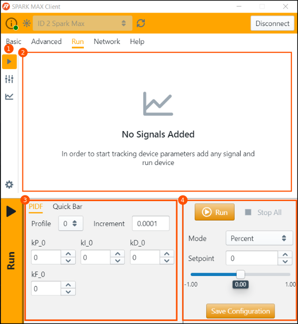

# Navigating the SPARK MAX Client

## Navigation Bar

The Navigation bar is visible on all tabs of the SPARK MAX Client and allows you to select with SPARK MAX the Client is connected to.

1. **Identify Device:** The status LED of a selected device will blink. This is helpful when troubleshooting or configuring multiple devices.
2. **Device Selection:** See each SPARK MAX connected to the SPARK MAX Client. This includes other devices connected via CAN if running firmware 1.4.0 or later.
3. **Rescan:** Looks for additional SPARK MAX devices connected to the SPARK MAX Client. This includes other devices connect via CAN if running firmware 1.4.0 or later.
4. **Connect/Disconnect:** After selecting a device connecting to the device pulls all the configuration parameters set on the device.
5. **Tabs**: Select one of the five tabs to gain access to configure, update, and run SPARK MAX.

## Basic Tab

The Basic Tab is used to set the most common parameters for the SPARK MAX

1. **Configurations:** This drop down allows you to select pre-existing configurations store on the Windows machine running the SPARK MAX Client or to pull the existing parameters stored on in RAM on the SPARK MAX. This is helpful when configuring multiple motor controllers to the same settings.
2. **CAN ID:** This assigns a SPARK MAX a CAN ID for identification over the CAN BUS. Any configured SPARK MAX **must have** a CAN ID.
3. **Configured Parameters:** Change the motor type, sensor type, idle mode behavior, and more.

## Advanced Tab

The Advanced Tab allows for changing all configurable parameters of the SPARK MAX without needing to set them in code.

1. **Search Parameters:** Allows for easy look up of a specific parameter for editing.
2. **Parameter Table:** Select the arrow to show all configurable parameters within a specific group. For more information on each parameter type see [Configuration Parameters](../../software-resources/configuration-parameters.md).

## Run Tab

The Run Tab allows for the SPARK MAX to operate over USB or a USB to CAN Bridge without the need for a full control system. This is helpful for testing mechanisms and tuning their control loops.

1. **Bar Select:** Select from either run, parameters, or signals to provide information and feedback when operating SPARK MAX.
2. **Signal Chart:** Shows any added signals in graph form when running a SPARK MAX. This is helpful when tuning control loops.
3. **PIDF:** Update PIDF parameters on the fly to tune control loops on the SPARK MAX.
4. **Run:** Choose setpoints to run a motor connected to a SPARK MAX using various modes, including position, velocity, and duty cycle.


The three icons for bar select change the bottom third of the Run Tab for configuration. Once signals and other parameters are configured selecting the run bar icon will allow for running of a motor with the SPARK MAX Client.


## Network Tab

The Network Tab shows all connected devices via USB and the USB to CAN interface. From the Network Tab each device can be identified and firmware updated.

1. **Device Select:** Select a device to update firmware.
2. **Load Firmware:** Select what firmware to update onto selected devices.


For more information on the firmware updating process see [Updating Device Firmware](updating-device-firmware.md) for both [single device](updating-device-firmware.md#updating-a-single-device) and [multiple device](updating-device-firmware.md#updating-multiple-devices-with-the-usb-to-can-bridge) updates.


