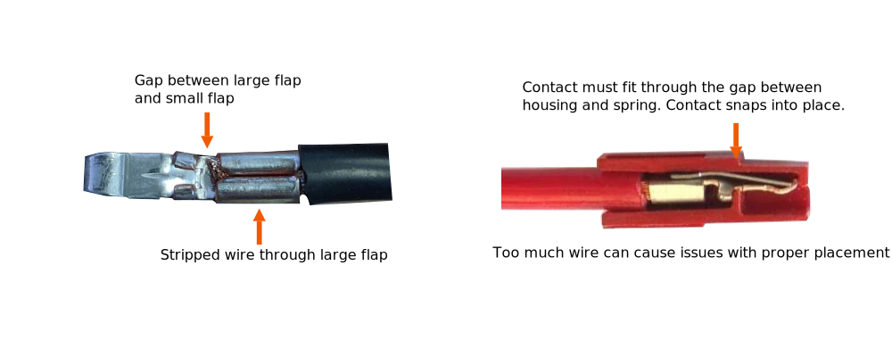

# Anderson Powerpole Connectors


**We're Updating our Documentation!** For the most up-to-date information about the SPARK MAX and other ION Motor Controllers please check out the following new documentation pages:&#x20;

* [REV ION Brushless ](https://docs.revrobotics.com/brushless)
  * [SPARK MAX Resources](https://docs.revrobotics.com/brushless/links#spark-max-links)
  * [REVLib for SPARK MAX](https://docs.revrobotics.com/brushless/spark-max/revlib)
* [REV Hardware Client Documentation](https://docs.revrobotics.com/rev-hardware-client/)


Anderson Powerpole connectors are a popular choice in the FIRST community for electrical connections. Ensuring that these connectors are crimped properly and the contact is fully inserted into the housing is key to having a good electrical connection.&#x20;

Anderson Powerpole Connectors consist of two major parts: the **housing** and **contact.** There are a number of different housings and contacts depending on the power requirements of the system. The most common housing and contact used with the SPARK MAX is the 1327 series housing paired with the 45 amp contacts.

### Anderson Connector Housing

The housings for the connectors are genderless allowing all powerpole connectors to mate with themselves. The 1327 series housing can utilize contacts rated for 15-45 amps. Housings come in a variety of colors allowing for easy pairings with the wire color.&#x20;

Dovetails on each housing allow them to slide together. Do not attempt to snap the housings together as they can break. After the housings are mated together adding a roll pin prevents the housings from become detached during operation. Each housing is fitted with a spring to retain the contacts after they are inserted

### Anderson Contacts

1327 series housings can use contacts rated for between 15 and 45 amps. The 45 amp contacts are used with the SPARK MAX. When striping wire for the contact, make sure the stripped wire is the length of the large flap. No wire should extend past the large flap into the gap between the large and small flaps on the contact. Utilize a proper crimping tool when crimping on the connector.

Having too much wire exposed can cause issues with proper placement of the contact in the housing. This can lead to bad connections. If the contacts are not fully inserted into the housing the contact connection issues can arise. The images above are examples of good crimps with the proper amount of wire inserted into the contact.

Having improper placement of the contact in the housing can lead to intermittent brownouts of the SPARK MAX, the contact dislodging from the housing, or have cause problems with one or more of the phases of a brushless motor.

For more information on powerpole assembly see the [Powerwerx ](https://powerwerx.com/help/powerpole-assembly-instructions)instructions.
