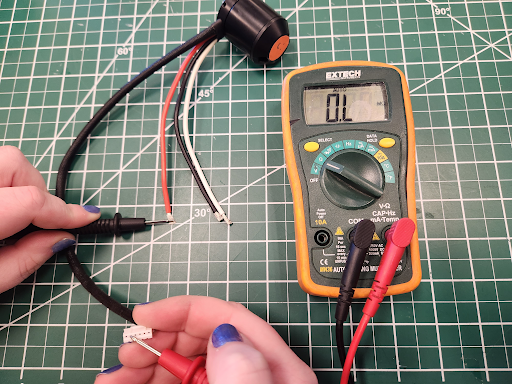

# Troubleshooting

Many issues can be solved by systematic troubleshooting without needing to contact REV Support. Take a look at the troubleshooting tips below for help in determining the cause of the issue you are seeing. Should you need to contact us, describing the steps you've taken in detail will help us get you up and running quickly.&#x20;

## General Troubleshooting Tips

The key to effective troubleshooting is isolating the issue. Many issues can show the same symptom, so eliminating failure points one at a time is critical to finding the root cause.

### Rule Out Issues By Isolation

If possible, try to eliminate a section of the system when troubleshooting. For example:

* Rule out a code or control wiring issue:
  * Use the REV Hardware Client to run the SPARK MAX over USB.
    * **Please be aware of the CAN lockout feature of the SPARK MAX.** If it has been connected to the roboRIO's CAN bus, a safety feature within the SPARK MAX will lock out USB communication. Disconnecting from the CAN bus and power-cycling the MAX will release the lock.
  * If this is your first time running the REV Hardware client, see the [Getting Started with the REV Hardware Client](rev-hardware-client/getting-started-with-the-rev-hardware-client/) for a tour of the software and its features.
* Rule out a code issue:
  * Create a simple test program using our SPARK MAX Example Code.
* Rule out a mechanical issue:
  * Remove the motor from the mechanism or use a different, free spinning motor.

### Use the Driver Station

An extremely useful set of tools can be found on the Driver Station:

* Use the [Driver Station Log File Viewer](https://docs.wpilib.org/en/latest/docs/software/driverstation/driver-station-log-viewer.html)
  * Look at the PDP channel current draw:
  *
    * Higher than expected current on a channel can indicate both mechanical and electrical issues.
  * Look at the battery voltage:
    * Large dips in the battery voltage around the time of an issue can indicate battery health issues that cause brownouts.
* Use the [CAN/Power Tab](https://docs.wpilib.org/en/latest/docs/software/driverstation/driver-station.html#can-power-tab)
  * Look at the CAN Bus Utilization.
  * Look at CAN Faults.
  * Look at Comms Faults:
    * Comms faults can affect the SPARK MAX. If it loses communication with the roboRIO, it will go to its safe disabled state. This can look like a momentary glitch in a motor spinning if the comms faults are infrequent and irregular.

### Use the APIs

It is also very useful to log or plot operating values internal to the SPARK MAX. These values can be accessed using the [SPARK MAX APIs](https://www.revrobotics.com/sparkmax-software/#api-info). Useful values to log:

* _getAppliedOutput()_
  * This value will show what the SPARK MAX is actually applying to the motor output. This can illuminate issues with closed loop control tuning.
* _getOutputCurrent()_
  * This value will show the output current going to the phases of the motor. [Output current won't always be the same as the Input current](https://www.chiefdelphi.com/t/neo-motors-pulling-only-5-amps-when-stalled/350542/25) measured by the PDP. Knowing the output current is useful to diagnose current-limit issues if motors are overheating.
* _getBusVoltage()_
  * A way to measure the input voltage right at the controller.
* _getStickyFaults()_
  * A sticky fault indicates if a fault has occurred since the last time the faults were reset. Checking these can provide a lot of insight into what the controller is experiencing.

## Common Faults and Issues

Below you will find some troubleshooting steps for some common faults and issues related to operating the SPARK MAX.

### Motor Not Spinning

### Gate Driver Fault

### Sensor Fault

### Powers via USB but not 12V

<figure><figcaption></figcaption></figure>

#### Continuity Check Instructions

| 
Measure the continuity between each of the motor phase wires and the sensor wire, as pictured here.  Also, check the resistance between wires of the sensor cable and motor wires. Reach out to support@revrobotics.com with results for each phase wire.
 |  |
| ---------------------------------------------------------------------------------------------------------------------------------------------------------------------------------------------------------------------------------------------------------------------- | ------------------------------ |
